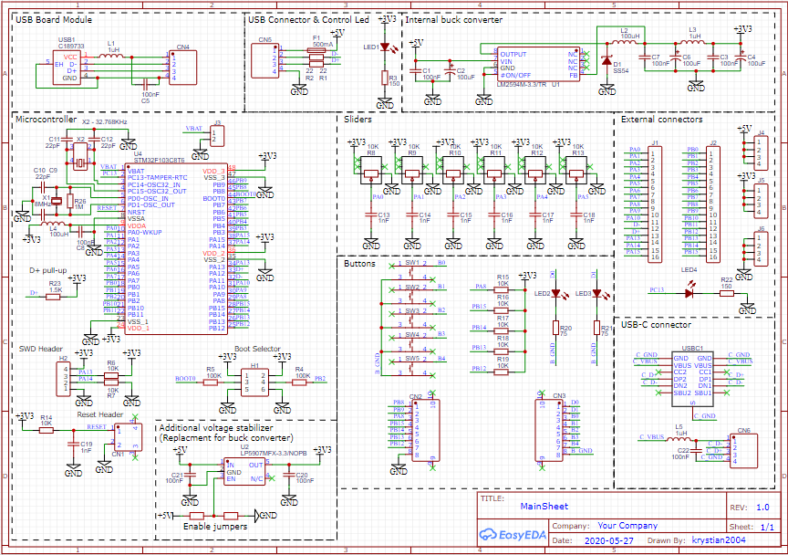
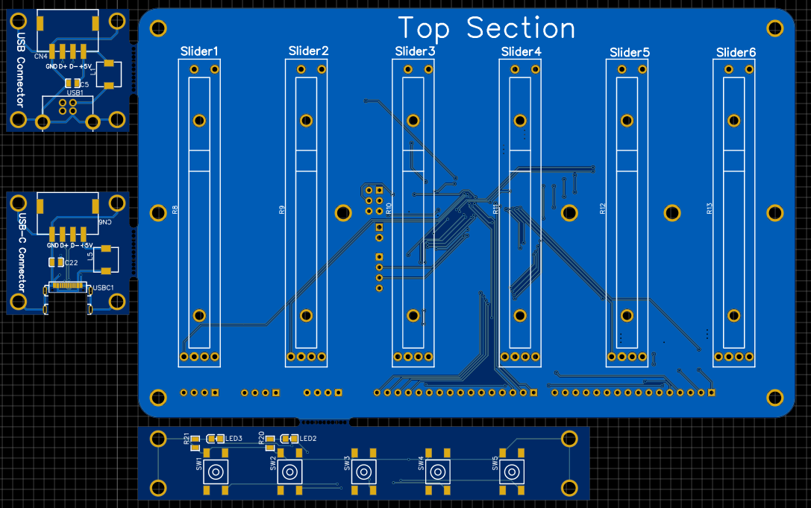
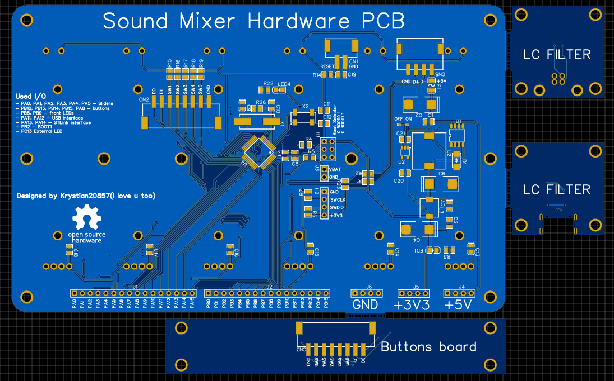
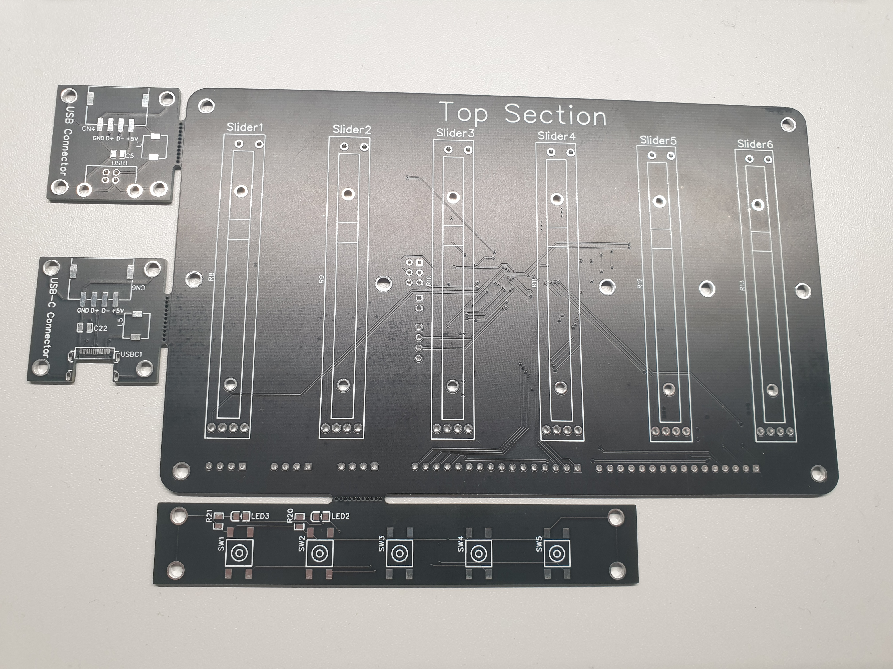
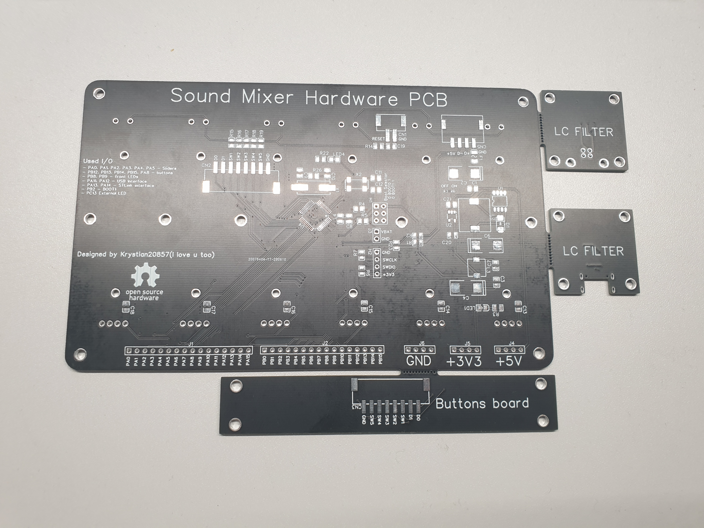
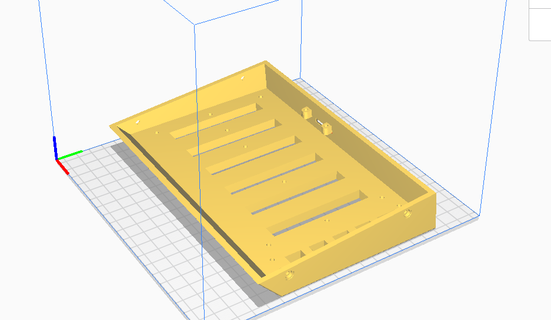
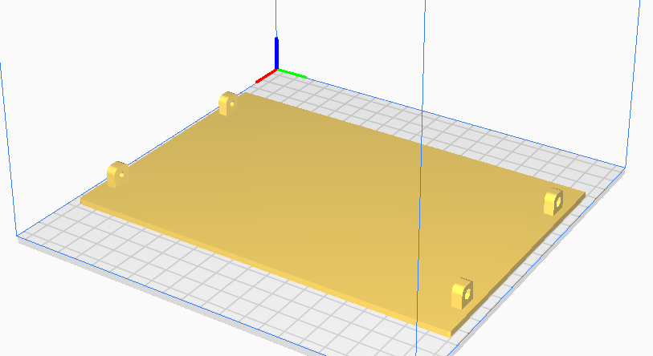
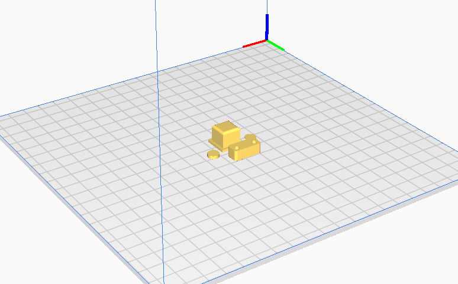

# SoundMixerHardware
SoundMixerHardware is sub-repository of [Sound Mixer](https://github.com/Krystian20857/SoundMixer) project. This repository contains:
* Electric schematics
* PCB desings
* BOM files 
* GERBER files
* STL models to print.

Schematic and PCB have been created using EasyEDA software which is integrated with LCSC part supplier. Using these tools speed up design process and made it easier.

## Content
* [Description](#sound-mixer-hardware)
* [Electric Design](#electric-design)
* [Models](#models)

## Electric Design
Design is very simple it consists of microcoltroller, power prividers, sliders, buttons and connectors. I predict alternative usage of linear voltage stabilizer and SMPS for more power hungry systems. Remember not to solder these parts together. All of microcoltroller pins are drived to external gold-pins.

#### Schematic

PCB consists of 4 separated PCBs: 
* USB-C connector
* USB-A connector
* Buttons Board
* Main Board

#### PCB Top

#### PCB Bottom

#### PCB Top in real life

#### PCB Bottom in real life

## Models
Models have been designed in *Fusion 360* and printed using *Anycubic i3 mega 3D printer* and *Anet A6 3D printer* with help of CURA slicing software.
#### Top Conver Model
Print Settings:
* Layer Height: 0.2mm
* Infill: 25%
* Supports: Yes
* Adhesion: None

#### Bottom Conver Model
Print Settings:
* Layer Height: 0.2mm
* Infill: 30%
* Supports: None
* Adhesion: None

#### Other Models
Print Settings:
* Layer Height: 0.2mm
* Infill: 50%
* Supports: None
* Adhesion: Brim

## End Result

